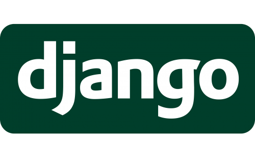

<p align="center">
  
</p>

<div align="center">
  
  
  
  
  
  
  
  
   
</div>

<div align=center>
  <h1>Landing Page Pactum Law Firm: Servicios Jurídicos</h1>
</div>
Este proyecto es un landing page desarrollado con Django para mostrar servicios jurídicos, con un enfoque en la presentación de abogados y sus perfiles sociales. Forma       parte de mi portafolio de proyectos para demostrar habilidades en el desarrollo web y la integración de backends dinámicos.

## Tabla de Contenidos
- [Descripción](#descripción)
- [Características](#características)
- [Instalación](#instalación)
- [Uso](#uso)
- [Capturas de Pantalla](#capturas-de-pantalla)
- [Tecnologías](#tecnologías)
- [Recursos y Créditos](#recursos-y-créditos)

## Descripción
Landing page desarrollado con Django que sirve como sitio web principal para una firma de abogados. Su objetivo principal es proporcionar un medio eficiente y profesional para que los clientes potenciales pueda:
- **Contactar la firma:** A través de un formulario de contacto integrado, los usuarios pueden enviar consultas directamente a la firma.
- **Explorar perfiles de abogados:** El sitio permite consultar información detallada sobre los abogados de la firma, incluidos sus nombres, especializaciones y redes sociales.
- **Acceder a redes de contacto:** Cada abogado posee sus redes de contacto para facilitar una comunicación directa y personalizada.
- **Informarse sobre la firma:** Nuestro landing page incluye secciones dedicadas a describir los servicios, valores y especializaciones de la firma.
Este proyecto fue diseñado para destacar el profesionalismo y la confiabilidad de la firma de abogados, proporcionando una experiencia de usuario intuitiva y responsiva.

## Características
Este proyecto aprovecha las capacidades de Django para gestionar contenido dinámico y facilitar la administración eficiente del sitio web. A continuación, se destacan las principales características técnicas:
- **Gestión de contenido dinámico:**
  Los modelos de Django gestionan las siguientes entidades:
    - Abogados: Información de cada abogado, incluyendo nombres, especialidad y redes sociales.
    - Acerca de: Información sobre la misión, visión y valores de la firma.
    - Características: Destacados sobre los servicios únicos de la firma.
    - Comunicaciones: Configuración del formulario de contacto para consultas generales.
    - Áreas de práctica: Detalles sobre los campos legales en los que la firma ofrece servicios.
- **Panel de administración personalizado:**
  Los administradores de la firma pueden actualizar y gestionar toda la información desde el panel de administración de Django, lo que facilita la gestión del sitio web sin necesidad de conocimientos técnicos avanzados.
- **Carga dinámica de contenido:**
  Se utiliza `context_processors` para cargar información común, como el menú o datos de contacto, y se integran vistas basadas en funciones(def) para manejar solicitudes específicas y mostrar contenido dinámico en cada sección.
- **Formulario de contacto:**
  Formulario estático integrado permite a los usuarios enviar consultas a la firma. Este utliza **Gmail SMTP** para garantizar la entrega segura y confiable de los correos electrónicos.
Esta arquitectura asegura un sitio web profesional, flexible y fácil de mantener, ofreciendo una experiencia de usuario optimizada.

## Instalación
1. Clona este repositorio:
    ``` bash
    git clone https://github.com/jnfmunoz/django-lawyer-website.git
    ```
    
2. Navega al directorio del repositorio:
   ``` bash
   cd django-lawyer-website 
   ```
   
3. Crea un entorno virtual:
   ``` bash
   python -m venv venv-django-lawyer-website
   ```
   
4. Para activar tu entorno virtual:
   ``` bash
   .\venv-django-lawyer-website\Scripts\activate
   ```
5. Instala las dependencias:
   ``` bash
   pip install -r requirements.txt
   ```

6. Realiza las migraciones:
   ``` bash
   python manage.py migrate
   ```

7. Iniciar el servidor de desarrollo:
   ``` bash
   py manage.py runserver
   ```

## Uso
1. Accede a `http://127.0.0.1:8000/`
2. Consulta acerca de la empresa:
   Navega y descubre la misión, visión y valores de la firma.
3. Áreas de práctica:
   Examina las diferentes áreas de práctica legales que la firma ofrece.
4. Consulta información sobre los abogados:
   Explora los perfiles de los abogados disponibles en la página principal. Cada perfil incluye detalles sobre su nombre, especialización y redes sociales para contacto.
5. Contacto de la firma: 
   Si deseas contactar a la firma de abogados, utiliza el formulario de contacto proporcionado. Rellena los campos con tu consulta y recibirás una respuesta vía correo electrónico a través de Gmail SMTP.

## Capturas de pantalla
#### Página de inicio
<p align="center">
  
</p>

### Acerca de
<p align="center">
  
</p>

### Áreas de práctica
<p align="center">
  
</p>

### Abogados
<p align="center">
  
</p>

### Contacto
<p align="center">
  
</p>

## Tecnologías
- **Django 4.2.16** - Framework web de Python.
- **Bootstrap 4.4.1** - Framework CSS para diseño responsivo.
- **Gmail SMTP** - Servicio de correo electrónico utilizado para gestionar el envío de mensajes desde el formulario de contacto.
- **Sweetify 2.3.1** - Librería para mostrar alertas personalizadas.
- **Python 3.11.4** - Lenguaje de programación utilizado para desarrollar el backend.
- **JavaScript** - Lenguaje para interactividad en el frontend.
- **HTML5** - Lenguaje de marcado utilizado para estructurar la página web.
- **SQLite3** - Base de datos utilizada (por defecto en Django).

## Recursos y Créditos
El diseño frontend utilizado en este proyecto fue clonado desde el repositorio: `https://htmlcodex.com/lawyer-website-template-free/`. Este repositorio proporciona la base del diseño responsivo y estructura visual de la página.
